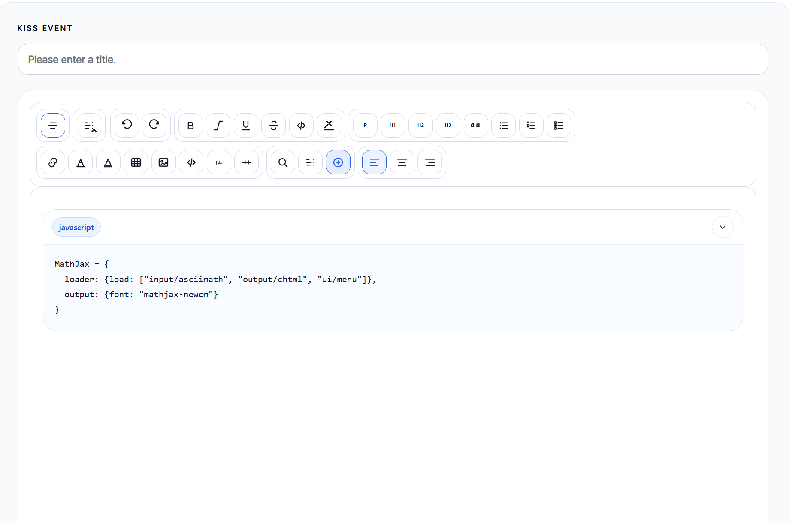
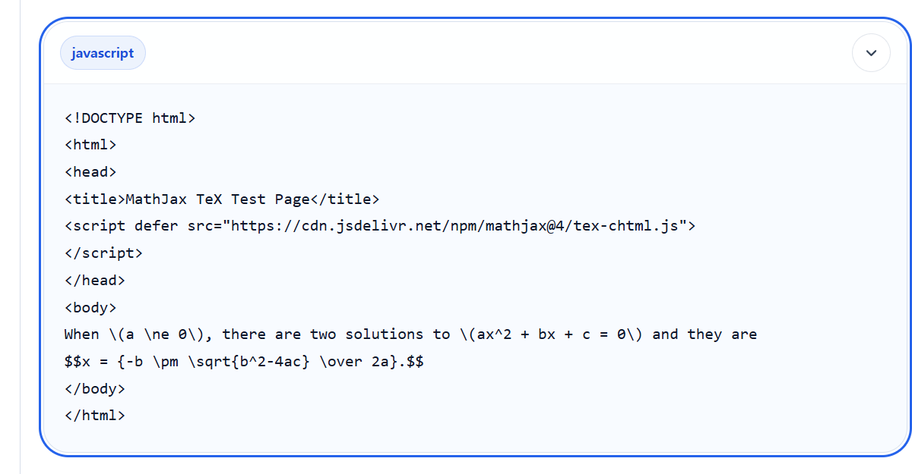
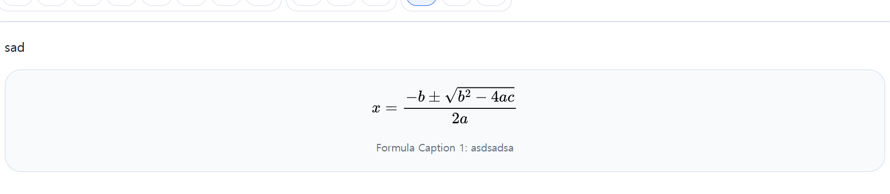
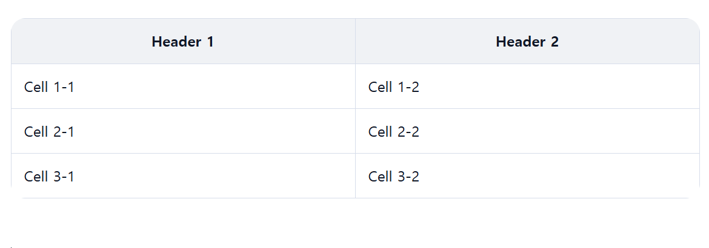

# SolidEdit

> 로컬 파일, 임베드 호스트 페이지, CDN 배포를 모두 고려한 오프라인 우선 리치 텍스트 에디터

---

## 🌐 Language

- [English README 보기](./README.md)
- 한국어 (이 파일)

---

## 개요

**SolidEdit 0.0.2**는 기존의 “로컬에서 바로 열어 쓰는 에디터”라는 방향을 유지하면서,
이를 **재사용 가능한 범용 임베디드 에디터 릴리스**로 정리한 버전입니다.

핵심 방향은 그대로입니다.

- 로컬 우선
- 예측 가능한 편집 동작
- 호스트 페이지에 과한 부담을 주지 않는 구조
- 데모용 과장보다 실제 편집 안정성 우선

다만 0.0.2에서는 문서화와 공개 사용법이 더 명확해졌습니다.

- 움직이는 최신 채널 `latest/`
- 고정 릴리스 채널 `versions/0.0.2/`
- `mountContentEditor`, `initContentEditor`, `CONTENT_EDITOR_*` 기반의 범용 호스트 API
- 기존 `STATKISS_*` 전역값은 호환성만 유지하고, 공개 문서에서는 쓰지 않음

---

## 0.0.2 핵심 정리

- 범용 임베디드 공개 API 정리
- `latest/`와 `versions/0.0.2/` 기준 CDN 예시 제공
- 이미지 / 표 / 수식 / 코드 블록에 대한 문맥형 Inspector 정리
- 이미지 / 표 / 수식 / 코드 블록 Caption 번호 매김 지원
- 이미지 Caption을 alt 역할로 재사용
- MathJax 렌더 / 재렌더 안정화
- 코드 블록 삽입 / 하이라이트 / 원본 보존 경로 안정화
- 모바일 호스트 레이아웃 대응 개선

---

## 기능 요약

### 리치 텍스트
- 굵게, 기울임, 밑줄, 취소선
- 문단, H1, H2, H3
- 인용문
- 순서 목록, 비순서 목록, 체크리스트
- 인라인 코드
- 링크 삽입
- 서식 제거
- 글자색 / 배경색
- 구분선

### Markdown
- Markdown 패널 토글
- Markdown 소스 편집
- Markdown 적용 / 미리보기
- Split View 지원

### 수식
- 인라인 / 블록 수식
- MathJax 렌더링
- 저장된 수식 원본 유지
- 편집 후 재렌더링

### 코드 블록
- 언어 선택
- Highlight.js 기반 하이라이트
- raw code 보존
- 편집 후 재하이라이트
- 유니코드 깨짐 / 마크업 역주입 케이스 방어 강화

### 이미지 / 표 / 구조 요소
- 이미지 붙여넣기 / 업로드 / 드래그 앤 드롭
- base64 이미지 + 압축
- 표 삽입 및 표 제어
- 선택 노드에 따라 달라지는 Inspector
- 자동 저장 / 스냅샷

---

## 스크린샷

> 아래 이미지는 0.0.2 안정화 과정에서 접근 가능했던 PNG 캡처를 문서용 파일명으로 다시 정리한 것입니다. 모두 `docs/images/` 아래에 포함했습니다.

<p align="center">
  
  
</p>

<p align="center">
  
  
</p>

---

## 0.0.1과 비교해서 무엇이 달라졌나?

이번 0.0.2는 **개념을 새로 뒤엎은 버전**이라기보다,
0.0.1 계열에서 드러난 문제를 정리한 **안정화 + 문서화 + 배포 구조 정리 릴리스**에 가깝습니다.

### 1. 공개 연동 API가 명확해졌습니다
기존 문서에서는 `window.SolidEdit.init(...)` 형태를 설명하고 있었지만,
0.0.2 문서에서는 공개 사용법을 아래 기준으로 정리해야 합니다.

- `window.mountContentEditor(target, options)`
- `window.initContentEditor(options)`
- `window.CONTENT_EDITOR_*` 전역 설정

기존 `STATKISS_*` 이름은 **호환성 alias**로만 보고,
SolidEdit 공개 문서와 예시에서는 쓰지 않는 것이 맞습니다.

### 2. CDN 릴리스 구조가 명확해졌습니다
0.0.2에서는 채널을 아래처럼 분리해 설명합니다.

- `latest/` → 계속 움직이는 최신 채널
- `versions/0.0.2/` → 고정된 0.0.2 릴리스 채널

### 3. 코드 블록이 더 안정화되었습니다
0.0.1 대비 0.0.2에서 강조되는 부분은 아래입니다.

- 코드 블록 중복 삽입 방지
- raw code 보존 강화
- 유니코드 깨짐 방어 강화
- 수정 후 하이라이트 재적용 안정화
- Highlight.js 기반 언어 지원 확장

### 4. 수식 렌더 경로가 더 안정화되었습니다
0.0.2에서는 아래 흐름을 더 분명히 다룹니다.

- 첫 로드 시 즉시 렌더
- 편집 후 재렌더
- 저장된 수식 원본 유지
- MathJax CDN 설정을 호스트 페이지에서 명시 가능

### 5. Inspector 동작이 더 예측 가능해졌습니다
0.0.2 정리 포인트는 아래입니다.

- 클릭 직후 Inspector가 바로 닫히는 문제 완화
- 선택 노드가 즉시 풀리는 문제 완화
- 선택한 노드와 관련된 섹션만 표시
- 중복되거나 의도치 않은 Inspector 제어 버튼 정리

### 6. Caption 기능이 확장되었습니다
0.0.2에서는 아래가 정리되었습니다.

- 이미지 Caption 번호 매김
- 표 Caption 번호 매김
- 수식 Caption 번호 매김
- 코드 블록 Caption 번호 매김
- 이미지 Caption을 alt 역할로 재사용

### 7. 모바일 / 호스트 페이지 통합이 개선되었습니다
이번 릴리스에서는 아래도 함께 정리되었습니다.

- 호스트 페이지 `index.html` 최소화
- 에디터 로직과 호스트 로직의 책임 분리
- 좁은 화면에서의 편집 레이아웃 안정화

간단 비교표는 [CHANGELOG_0.0.2_vs_0.0.1.md](./CHANGELOG_0.0.2_vs_0.0.1.md)에서 다시 볼 수 있습니다.

---

## Repository 구조

0.0.2 기준으로 문서까지 포함한 실무형 구조 예시는 아래처럼 잡을 수 있습니다.

```text
solid-edit/
├── README.md
├── README.ko.md
├── CHANGELOG_0.0.2_vs_0.0.1.md
├── CHATGPT_PROJECT_INSTRUCTIONS.ko.md
├── docs/
│   └── images/
│       ├── basic-layout.png
│       ├── code-block.png
│       ├── formula-caption.png
│       └── table-block.png
├── examples/
│   └── cdn-basic/
│       └── index.html
├── latest/
│   └── editor.js
└── versions/
    └── 0.0.2/
        └── editor.js
```

---

## CDN 경로

### latest 채널
```html
<script src="https://cdn.jsdelivr.net/gh/statground/solid-edit@main/latest/editor.js"></script>
```

### 고정 0.0.2 릴리스
```html
<script src="https://cdn.jsdelivr.net/gh/statground/solid-edit@0.0.2/versions/0.0.2/editor.js"></script>
```

### 아직 tag를 만들기 전 사용할 수 있는 main fallback
```html
<script src="https://cdn.jsdelivr.net/gh/statground/solid-edit@main/versions/0.0.2/editor.js"></script>
```

---

## 공개 API

### 명시적 mount
```javascript
window.mountContentEditor(target, options);
```

일반적인 사용 예시:

```javascript
window.mountContentEditor("#postBody", {
  placeholder: "Write your content here.",
  titleField: "#postTitle",
  storageKey: "solid-edit-demo-0.0.2"
});
```

### observer 기반 auto-init
```javascript
window.initContentEditor({
  target: "#postBody"
});
```

---

## 범용 호스트 전역값

공개 예시와 문서에서는 아래 **범용 전역값**을 쓰는 것을 기준으로 합니다.

```javascript
window.CONTENT_EDITOR_AUTOSTART = false;
window.CONTENT_EDITOR_AUTOINIT = false;
window.CONTENT_EDITOR_CONFIG = {
  placeholder: "Write your content here."
};
window.CONTENT_EDITOR_MATHJAX_CDN_URL = "https://cdn.jsdelivr.net/gh/mathjax/MathJax@3.2.2/es5/tex-svg.js";
window.CONTENT_EDITOR_HLJS_SCRIPT_SRC = "https://cdn.jsdelivr.net/gh/highlightjs/cdn-release@11.11.1/build/highlight.min.js";
window.CONTENT_EDITOR_HLJS_STYLE_HREF = "https://cdn.jsdelivr.net/gh/highlightjs/cdn-release@11.11.1/build/styles/github.min.css";
```

기존 `STATKISS_*` 전역값은 오래된 호스트 페이지를 위한 호환성 alias일 뿐,
SolidEdit의 공개 이름 체계로 문서화하지 않는 것이 맞습니다.

---

## 기본 CDN 예시

범용 예시 HTML은 아래 파일에 넣어두었습니다.

```text
examples/cdn-basic/index.html
```

이 예시는 다음을 보여줍니다.

- StatKISS와 무관한 중립적 호스트 페이지
- title input + textarea 구조
- 명시적 `mountContentEditor(...)`
- `CONTENT_EDITOR_*` 기준 설정
- 고정 0.0.2 CDN 경로와 대체 경로 주석

---

## self-hosting 메모

jsDelivr 대신 직접 호스팅할 경우에도 아래 원칙은 동일합니다.

- 에디터 번들 경로를 안정적으로 유지
- 호스트 페이지 전역값은 범용 이름 사용
- README와 실제 공개 API를 반드시 일치
- 실제로 없는 `window.SolidEdit.init(...)` 같은 API를 문서에 적지 않기

---

## License

MIT

---

## 제작

**Statground**
