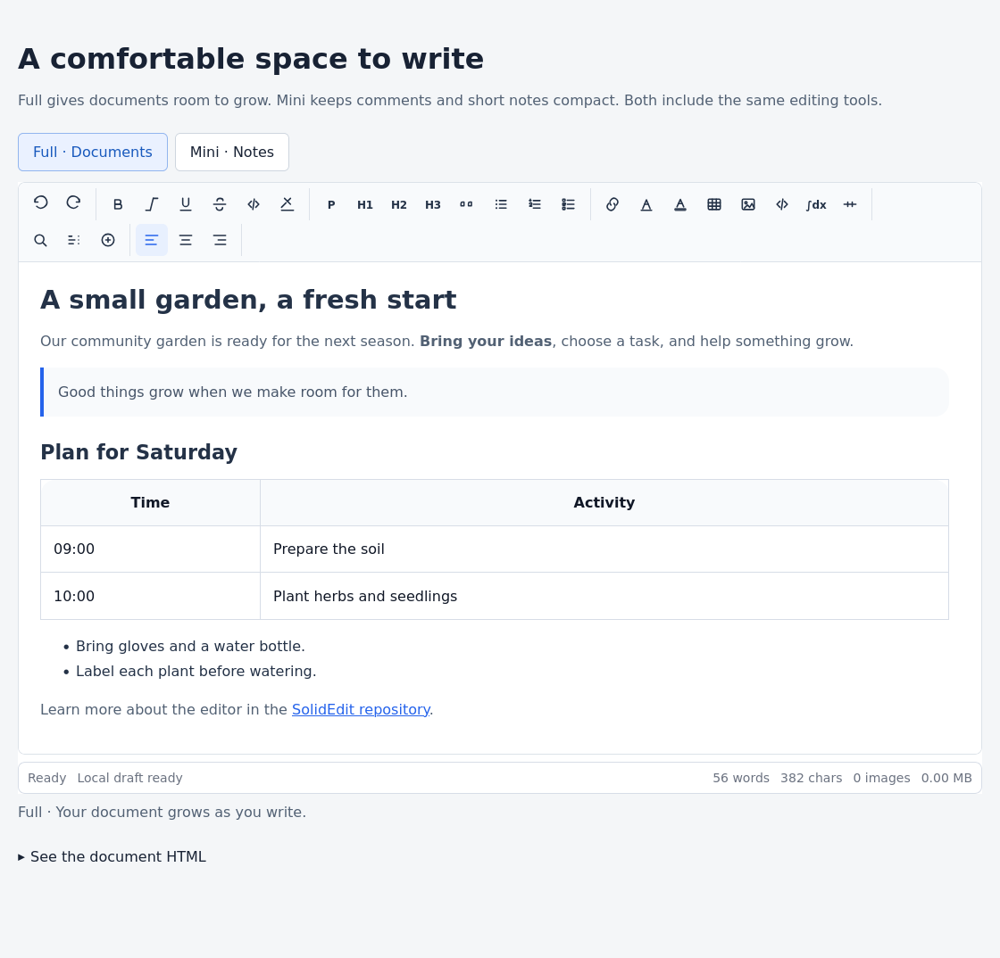

# SolidEdit

Write articles, meeting notes, and research documents with images, tables, code, and formulas. Embed the editor in a textarea with one JavaScript file.

[한국어](README.ko.md) · [Try it on Statground](https://testgo.statground.net/toolbox/solid-edit/)

## Choose your editing space

**0.0.4** introduces a flat toolbar, clear group separators, readable labels, and a consistent focus state. All editing tools stay visible in both modes.

| | Full | Mini |
|---|---|---|
| Best for | Articles and documents | Comments and short notes |
| Buttons / icons | 36px / 20px | 28px / 16px |
| Writing space | Expands with the document | Scrolls within a compact area |
| Tools and saved HTML | Same | Same |

Switching density does not change the document format. Narrow screens wrap the tools onto additional rows.



## Start editing

Copy this into an HTML page. Replace `RELEASE_COMMIT_SHA` with the 40-character commit containing the `versions/0.0.4/editor.js` bundle.

```html
<textarea id="content"><h2>My first document</h2><p>Start here.</p></textarea>
<script>
  window.CONTENT_EDITOR_AUTOSTART = false;
  window.CONTENT_EDITOR_AUTOINIT = false;
</script>
<script src="https://cdn.jsdelivr.net/gh/statground/solid-edit@RELEASE_COMMIT_SHA/versions/0.0.4/editor.js"></script>
<script>
  const editor = window.mountContentEditor("#content", {
    lang: "en",
    toolbarSize: "full",
    restoreDraft: false,
    storageKey: "my-document-draft"
  });
</script>
```

For a compact comment editor, pass `toolbarSize: "mini"`. Mini uses a 160px minimum and a 320px maximum writing height by default. Full starts at 320px and grows with its content. Set numeric `minHeight` and `maxHeight` options when your host needs another size.

```js
const comment = window.mountContentEditor("#comment", {
  toolbarSize: "mini",
  placeholder: "Add a comment…",
  minHeight: 160,
  maxHeight: 320,
  storageKey: "my-comment-draft"
});
```

Open [the complete Full/Mini example](examples/cdn-basic/index.html) from a local web server to try both modes. The checked-in example loads the bundled release; its script URL can be replaced with your pinned CDN URL.

## What can I put in a document?

- **Text:** headings, bold, italic, underline, strike, inline code, text color, and highlights.
- **Structure:** paragraphs, quotes, lists, checklists, alignment, and dividers.
- **Images:** upload, paste, or drag an image into the document; then adjust its size and caption.
- **Tables:** insert a table and select it to edit its rows, columns, and caption.
- **Code:** choose a language and keep the original code alongside highlighted output.
- **Formulas:** write inline or block LaTeX and keep the original formula for later editing.
- **Markdown:** inspect or edit the source and use split view while writing.

Select an image, table, code block, or formula to open its contextual controls. Hover a toolbar button for its name; keyboard focus remains visible.

## Read, replace, and remove

```js
const html = editor.getHTML();           // Save the rich document
const markdown = editor.getMarkdown(); // Export Markdown
editor.setHTML("<h2>Updated</h2><p>Keep writing.</p>");
window.destroyLocalRichEditor(editor); // Unmount before removing the host
```

HTML retains rich formatting. Markdown cannot represent every visual property, such as image sizing, color, or table styling.

Drafts use browser storage. Give separate documents distinct `storageKey` values. `restoreDraft: false` starts from the supplied content; it does not disable later draft writes. Save `getHTML()` through your application when users submit their work.

## Code and formula rendering

SolidEdit supports Highlight.js and MathJax. Configure their locations before loading the editor when your application owns dependency loading:

```js
window.CONTENT_EDITOR_ENABLE_CODEBLOCK = true;
window.CONTENT_EDITOR_HLJS_SCRIPT_SRC = "YOUR_PINNED_HIGHLIGHT_JS_URL";
window.CONTENT_EDITOR_HLJS_STYLE_HREF = "YOUR_PINNED_HIGHLIGHT_CSS_URL";
window.CONTENT_EDITOR_MATHJAX_CDN_URL = "YOUR_PINNED_MATHJAX_TEX_SVG_URL";
```

Host applications with a Content Security Policy must permit these assets and image data URLs. The [Statground setup example](https://testgo.statground.net/toolbox/solid-edit/#setup) includes the complete pinned renderer setup. Existing code and formula sources are retained in the document.

## Files and compatibility

- `versions/0.0.4/editor.js`: current release bundle.
- `latest/editor.js`: the same bundle at release time; this path changes during development.
- `versions/0.0.3/editor.js`: previous release, retained unchanged.
- `tests/`: Node contracts and a browser fixture.

Pin a commit SHA for deployed applications. Use `latest/` only for development. The public APIs are `mountContentEditor`, `initContentEditor`, and the `CONTENT_EDITOR_*` globals. Older `STATKISS_*` names remain compatibility aliases.

MIT · Statground
